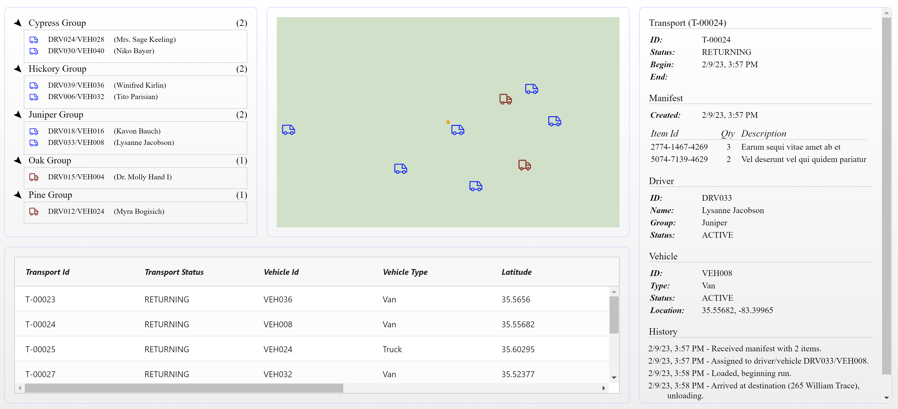

# Data Push Example

Experiments around pushing rapidly changing data to browser.

Technologies used:

- [Nx Build System](https://nx.dev)
- [.NET 7.x](https://dotnet.microsoft.com/en-us/download/dotnet/7.0)
- [Hot Chocolate GraphQL](https://chillicream.com/docs/hotchocolate/v13)
- [URQL GraphQL Client](https://formidable.com/open-source/urql/)
- [React](https://reactjs.org/) and [TypeScript](https://www.typescriptlang.org/)
- [Zustand](https://github.com/pmndrs/zustand)

To Run:

- `npm install`
- `npm run serve`

## Implementations

### Polling

So not pushing data to browser, but just using the client to periodically refresh the data.

### GraphQL Subscriptions

Pushing data to the browser using GraphQL subscriptions via websockets.
